# DeepRacer 2019 Sandbox

This is my full collection of tools, notebooks, scraps for participation in 2019 [AWS DeepRacer Virtual League](http://deepracerleague.com/).

What you'll find in this repo:

- Local training assets: container Dockerfiles, launch scripts mostly in bash, monitoring scripts
- AWS cloud-based training scripts: pre-dating my local training setup, but most useful for cloud-based evaluations of local training
- Analysis Notebook
- Models/Experiments: all the training sessions hyperparameters, reward functions, action space
- RoboMaker simapp: scripts to build the bundle, source files to add or replace files within the bundle
- Twitch streaming assets: UI (flask-based), ffmpeg tools to stream from simulation
- Airflow automation DAGs

**NB:** I am not an expert in ML/RL and participation in DeepRacer was a way to educate myself.  Forgive me any naive or wrong approaches taken.  Feel free to send me any observations, suggestions for different approaches, related papers or projects, or just to drop me a line.

**Race Results**

| Race                                                         | Standing        |
| ------------------------------------------------------------ | --------------- |
| August 2019 Virtual Race [Shanghai Sudu](https://aws.amazon.com/deepracer/schedule-and-standings/leaderboard-virtual-shanghai-sudo-circuit-2019/) | **102** of 1375 |
| September 2019 Virtual Race [Cumulo Carrera](https://aws.amazon.com/deepracer/schedule-and-standings/leaderboard-virtual-cumulo-carrera-2019/) | **132** of 1338 |
| October 2019 Virtual Race [Toronto Turnpike](https://aws.amazon.com/deepracer/schedule-and-standings/leaderboard-virtual-toronto-turnpike-2019/) | **60** of 1983  |
| November 2019 Virtual Race [Championship Cup Warm-up](https://console.aws.amazon.com/deepracer/home?region=us-east-1#leaderboard/Championship%20Cup%20Warm-up) | **8** of 904    |
| [AI Driving Olympics at NeurIPS](https://driving-olympics.ai/?page_id=24) | Phase I: Perception challenge: **Top 10** Phase II: Simulation to Reality challenge: *did not place* |

The code and scripts are shared here unfiltered.  Some items may be broken or hacky.  The goal was to educate myself about reinforcement learning and train competitive models, sometimes at the expense of good coding practices.  I'll be starting a new repo for any work I do on the 2020 DeepRacer races and won't be adding any more changes to this code.

I'll follow here with some select items that I hope may be of interest to those looking to compete in the 2020 DeepRacer League.

----

# RoboMaker Bundle Management

The official SimApp bundle for DeepRacer is publicly readable and located at [https://s3.amazonaws.com/deepracer-managed-resources/deepracer-github-simapp.tar.gz](https://s3.amazonaws.com/deepracer-managed-resources/deepracer-github-simapp.tar.gz)

[robomaker/deepracer-simapp.tar.gz.md5](robomaker/deepracer-simapp.tar.gz.md5) - MD5 of the bundle to verify we're using the correct base for file patches

[airflow/monitor_deepracer_simapp.py](airflow/monitor_deepracer_simapp.py) - Script to monitor the hosted simapp bundle for changes.  Currently uses a date-based validation comparing official bundle to a copy stored in an S3 bucket I own

[patch/*](patch) - overlay files to add or replace files within the bundle.  These are mostly local edits to `markov` package, additional gazebo assets, added parameters to launch files.

[scripts/bundle.sh](scripts/bundle.sh) - Create a bundle using the base simapp and overlaying files from patch/.

[scripts/publish.sh](scripts/publish.sh) - Upload the patched bundle to an S3 bucket owned by me, consumable by RoboMaker for running patched simulations in the cloud

----

# Local Training

This was grown out of necessity and not out of convenience.  Therefore it is completely custom for my preferences and does not use the well-known DeepRacer Community training stack on GitHub.

**Goals for my local stack were:**

- Full access to the simapp bundle code to edit or add files
- Fast iteration on code changes to the simapp bundle using [Docker volumes](https://docs.docker.com/storage/volumes/) to patch containers
- Unified logging for later analysis
- Replication of all training artifacts to S3, effectively making local storage a "cache" that can be cleared

**Components:**

- dr-training - Sagemaker/TensorFlow training
- dr-simulation - RoboMaker/ROS/Gazebo simulation
- dr-redis - pub/sub between dr-simulation and dr-training
- dr-logger - "sidecar" logger to aggregate all container logs and write them to JSON files
- dr-uploader - background synchronization of training assets and logs to S3 bucket
- minio - S3 replacement to store training checkpoints locally

**Interesting bits:**

[container/Dockerfile.*](container) - Dockerfiles for the local training setup

[scripts/launch_local.sh](scripts/launch_local.sh) - Entrypoint for local training kickoff

[models/*](models) - Inputs for local training, a unique folder for each training session with hyperparameters, action space, reward function

[docker-compose.yml](docker-compose.yml) - container configuration

----

# Twitch Streaming

I streamed training at [https://www.twitch.tv/deepstig](https://www.twitch.tv/deepstig) later in the season.  I used [OBS](https://obsproject.com/) to host a browser-based UI with a VLC stream overlay, sending frames out of my local training simulation via ffmpeg over udp.

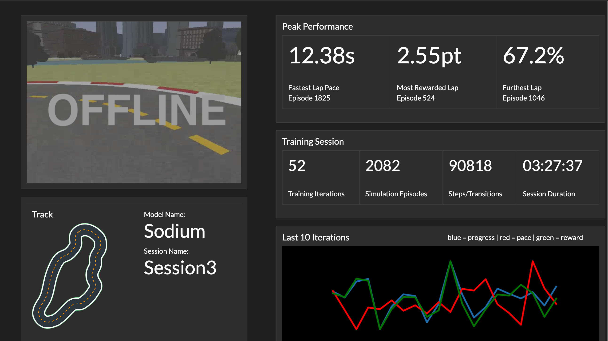

[twitch/app.py](twitch/app.py) - Flask app to show a UI with some near-real-time metrics 

[container/streamer.sh](container/streamer.sh) - In-container script to listen to ROS camera node RGB image messages and pipe them directly to ffmpeg stdin in order to generate a mpegts stream over udp

[scripts/monitor_video.sh](scripts/monitor_video.sh) - Script to launch `streamer.sh` within the container, passing in the udp stream destination

----

# Log Analysis

Based on [AWS DeepRacer Workshop](https://github.com/aws-samples/aws-deepracer-workshops/blob/master/log-analysis/DeepRacer%20Log%20Analysis.ipynb) Jupyter notebook but heavily modified.  Any time I had a question about training progress or simulation behavior I would add some new features to this.  Its really overgrown now but gives me a full and complete picture of training as I run it.

For brevity, I'll pull out a few interesting sections but you can click to the [full notebook](log_analysis/DeepRacer Log Analysis.ipynb) to see the code.

| Description                                                  |                 |
| ------------------------------------------------------------ | --------------- |
| Training progress, loss.  I would watch this to discover points at which I would need to stop training or adjust hyperparameters. | 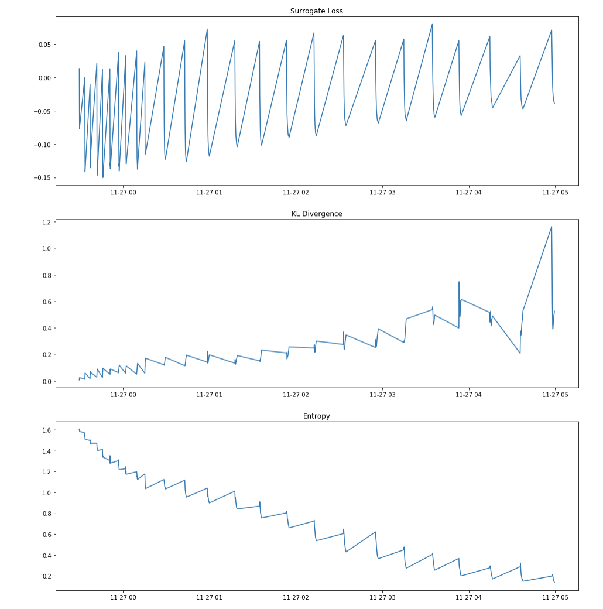  |
| Action space usage.  This helped me to know if there were unused actions that could be culled out. | 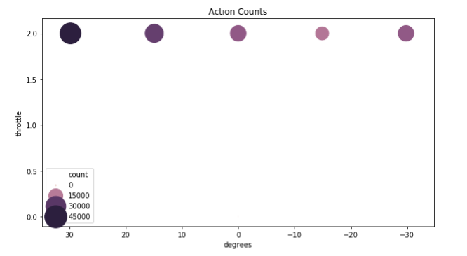  |
| Car performance during training. Mostly scatterplots of episodic metrics, with mean for the iteration overlaid in orange.  The most intersting is the fourth graph which shows progress per lap, but also ratio of completed laps.  If the completion ratio was between 20% (red) and 40% (green) lines, I would submit the model for racing.  If the completion ratio was more than 40%, I would push the speed a little further and retrain. | 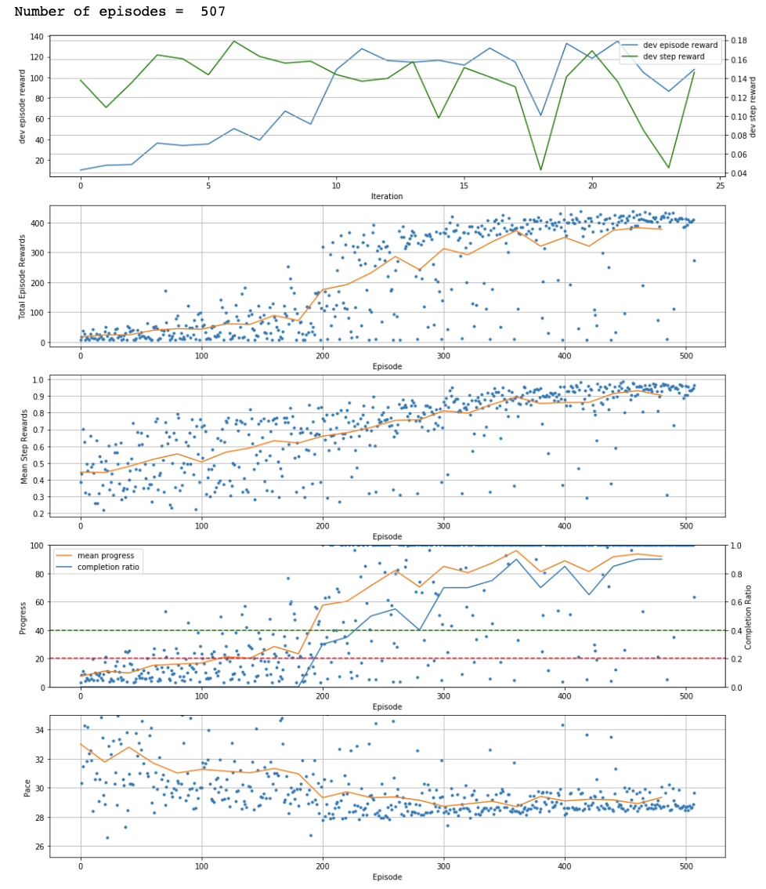 |
| Correlate high rewards to high speed.  If they don't correlate then there is most likely a problem in the reward function. | 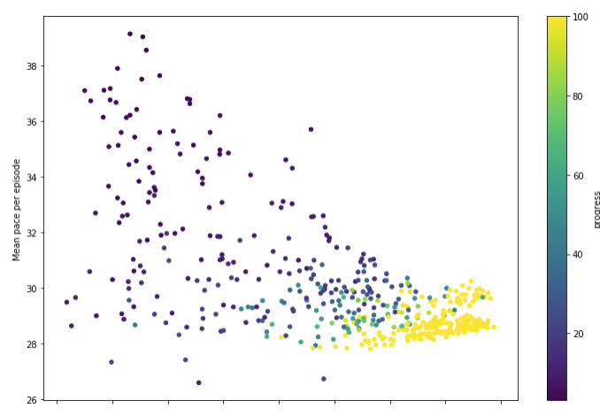  |
| Heatmap showing rewards for each step.  A good indicator of the line that is rewarded traversing the track. | 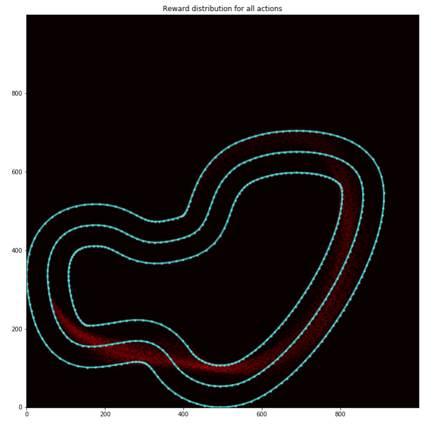  |
| Exit points plot.  Clumped exit points may indicate an action space can be modified to have a better turn angle, or that reward function might be rewarding a wrong action. |   |
| Actions mapping.  Only really useful for an action space with one speed per steering angle.  Correlates actions with track waypoints. | 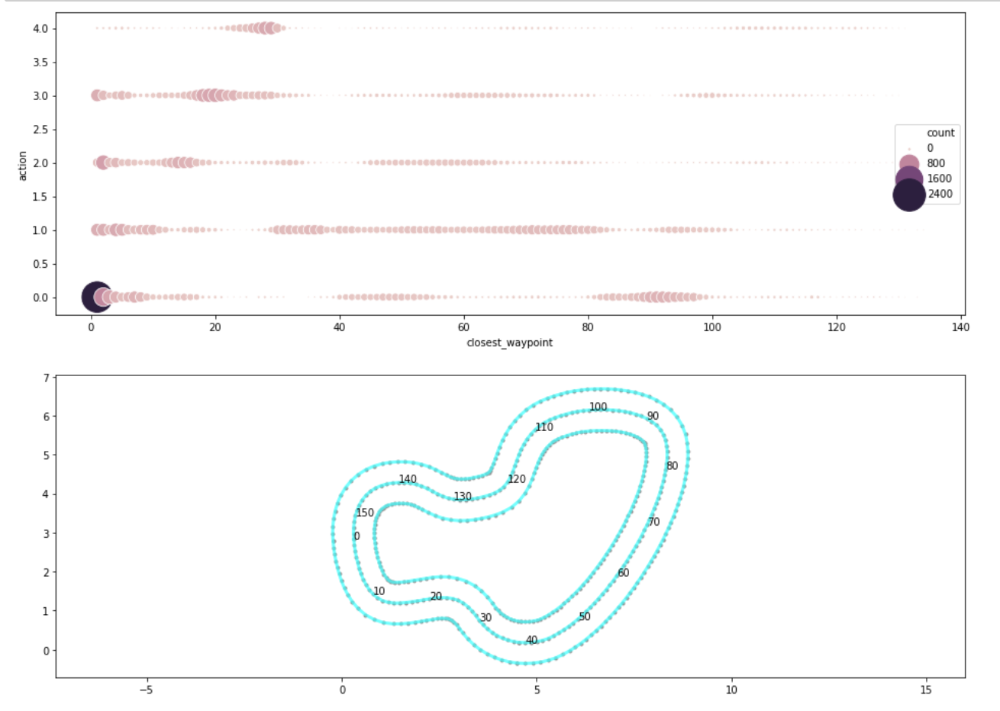  |
| Single episode summary.  Shows: step location, heading angle (black), steering angle (red), episode pace | 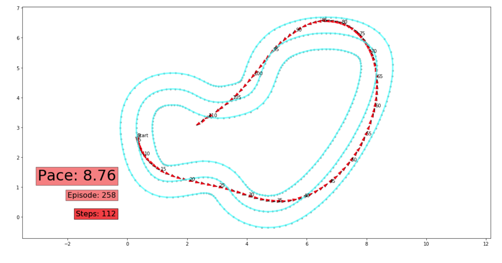  |
| Speed.  Blue line is the actual speed, measured as incremental distance between steps.  Yellow is throttle and cyan is steering.  This helps to easily see the effect of steering and throttle position on speed. | 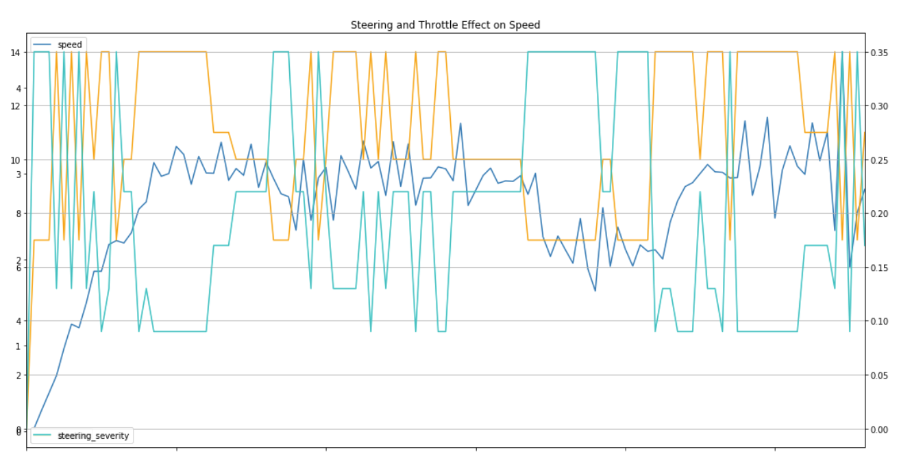  |
| Correlate steering with heading change.                      | 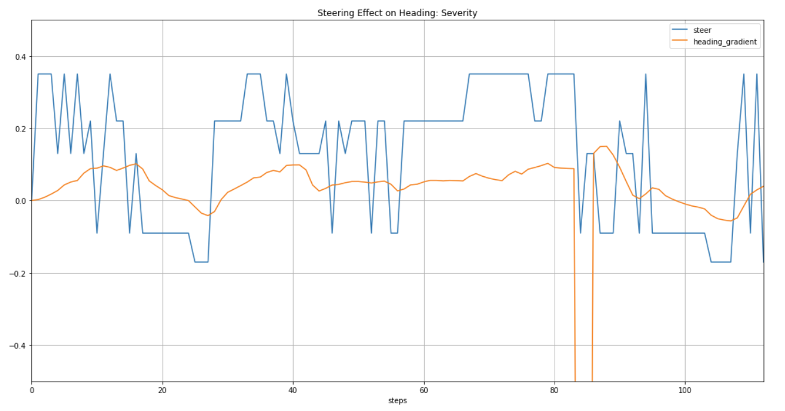 |
| Reward and Progress.  This graph verifies higher rewards for higher progress per step. | 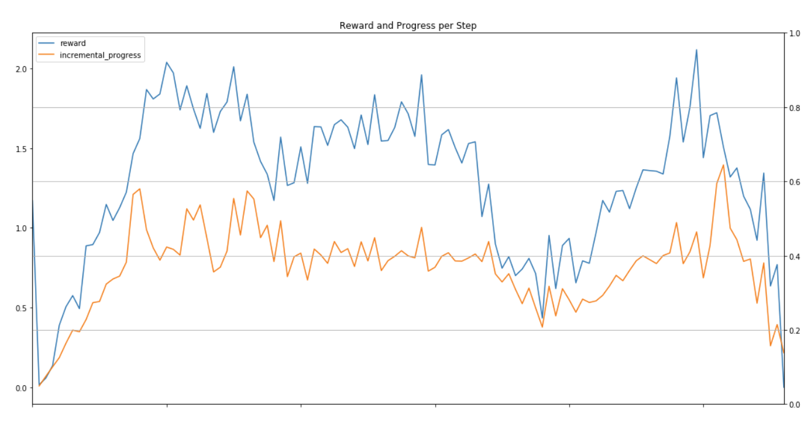 |
| Try to detect slippage.  The car can wipe out on turns if speed is too high.  This graph shows when heading and direction of movement over ground don't correlate. | 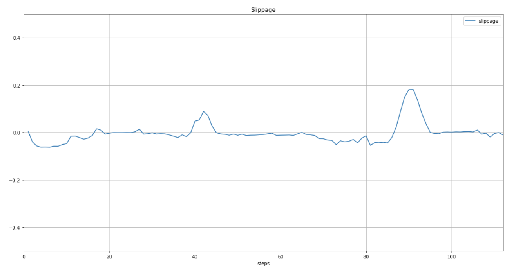 |
| Run inference on an image to find its action probabilities.  This can indicate the health of the model. | 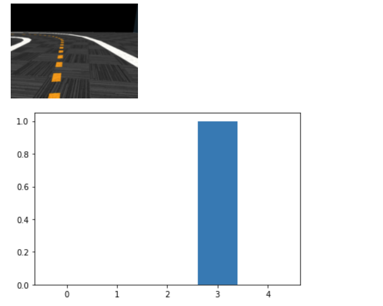 |
| GradCAM.  Finds the aspects of the image that the network is focusing on. | 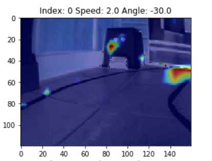 |
| Convolutional layer activations.  This is mostly for making the convolutional layers more interpretable by seeing the features they activate on. | 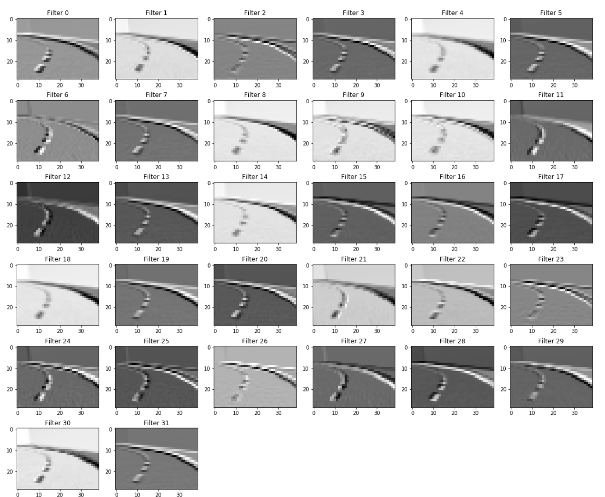 |

**Interesting items**:

[log_analysis/DeepRacer Log Analysis.ipynb](log_analysis/DeepRacer%20Log%20Analysis.ipynb) - The notebook

[log_analysis/images/*](log_analysis/images/) - Still image captures of a variety of tracks to use in analysis, such as running it through the model to get action probabilities

---

# Airflow Automation

I had aspired to use airflow to work through a queue of training and evaluation jobs but ultimately didn't end up spending the time automating to that level.  The primary usage of airflow was to submit the model to the virtual league every ~30 minutes.  

It was unfortunate but the winners were so close that luck and brute force had a large part in getting to the top positions.  This would use Selenium and ChromeDriver submit the model, and also handle any authentication that might need to happen as part of that workflow.

[airflow/deepracer_submit_dag.py](airflow/deepracer_submit_dag.py) - Submit a model for evaluation every 30 minutes

---

# Resources

### Official AWS Resources

- AWS DeepRacer Documentation [https://docs.aws.amazon.com/deepracer/index.html#lang/en_us](https://docs.aws.amazon.com/deepracer/index.html#lang/en_us)
- AWS DeepRacer League [https://aws.amazon.com/deepracer/league/](https://aws.amazon.com/deepracer/league/)
- AWS Cost Management [https://console.aws.amazon.com/cost-reports/home?region=us-east-1#/dashboard](https://console.aws.amazon.com/cost-reports/home?region=us-east-1#/dashboard)
- AWS SageMaker Python SDK [https://github.com/aws/sagemaker-python-sdk](https://github.com/aws/sagemaker-python-sdk)

### Components of DeepRacer

- AWS SageMaker
- AWS RoboMaker
- AWS Kenesis
- AWS CloudWatch Logs
- AWS S3
- AWS Lambda

### Useful Tools

- rviz: rviz is a 3d visualization tool for ROS applications [https://docs.aws.amazon.com/robomaker/latest/dg/simulation-tools-rviz.html](https://docs.aws.amazon.com/robomaker/latest/dg/simulation-tools-rviz.html)
- rqt hosts a number of different plugins for visualizing ROS information [https://docs.aws.amazon.com/robomaker/latest/dg/simulation-tools-rqt.html](https://docs.aws.amazon.com/robomaker/latest/dg/simulation-tools-rqt.html)
- Gazebo lets you build 3D worlds with robots, terrain, and other objects [https://docs.aws.amazon.com/robomaker/latest/dg/simulation-tools-gazebo.html](https://docs.aws.amazon.com/robomaker/latest/dg/simulation-tools-gazebo.html)
- ROS: Robot Operating System which AWS RoboMaker is based on [https://www.ros.org/](https://www.ros.org/)
- TensorFlow ML which AWS SageMaker is based on [https://www.tensorflow.org/](https://www.tensorflow.org/)
- Pandas: Python Data Analysis Library [https://pandas.pydata.org/](https://pandas.pydata.org/)
- Actual RoboMaker simulation environment for DeepRacer [https://s3.amazonaws.com/deepracer-managed-resources/deepracer-github-simapp.tar.gz](https://s3.amazonaws.com/deepracer-managed-resources/deepracer-github-simapp.tar.gz)
- Coach is the implementation of RL algorithms (PPO, CPPO, TRPO, etc) used in the RLEstimator that aggregates training data back into the model in SageMaker [https://github.com/NervanaSystems/coach](https://github.com/NervanaSystems/coach)
- OpenVINO is used to execute the RL model on the car hardware or ROS simulator [https://01.org/openvinotoolkit](https://01.org/openvinotoolkit)
- PyTorch: ML framework that effectively is SageMaker; also usable on Google Cloud and Azure [https://pytorch.org/](https://pytorch.org/)

### Community Resources

- *AWS DeepRacer AMI* [https://github.com/jarrettj/deepracer-ami](https://github.com/jarrettj/deepracer-ami)
- *A repo for running deepracer locally* [https://github.com/crr0004/deepracer](https://github.com/crr0004/deepracer)
- *Train DeepRacer model locally with GPU support* [https://medium.com/@jonathantse/train-deepracer-model-locally-with-gpu-support-29cce0bdb0f9](https://medium.com/@jonathantse/train-deepracer-model-locally-with-gpu-support-29cce0bdb0f9)
- *Using Jupyter Notebook for analysing DeepRacer's logs* [https://codelikeamother.uk/using-jupyter-notebook-for-analysing-deepracer-s-logs](https://codelikeamother.uk/using-jupyter-notebook-for-analysing-deepracer-s-logs)
- *2019 AWS Summits DeepRacer Lab* [https://github.com/aws-samples/aws-deepracer-workshops/tree/master/Workshops/2019-AWSSummits-AWSDeepRacerService/Lab1](https://github.com/aws-samples/aws-deepracer-workshops/tree/master/Workshops/2019-AWSSummits-AWSDeepRacerService/Lab1)
- *AWS Samples: DeepRacer Workshop Content* [https://github.com/aws-samples/aws-deepracer-workshops](https://github.com/aws-samples/aws-deepracer-workshops)
- *Analyzing the AWS DeepRacer logs my way* [https://codelikeamother.uk/analyzing-the-aws-deepracer-logs-my-way](https://codelikeamother.uk/analyzing-the-aws-deepracer-logs-my-way)
- *Deep Reinforcement Learning Models: Tips & Tricks for Writing Reward Functions* [https://medium.com/@BonsaiAI/deep-reinforcement-learning-models-tips-tricks-for-writing-reward-functions-a84fe525e8e0](https://medium.com/@BonsaiAI/deep-reinforcement-learning-models-tips-tricks-for-writing-reward-functions-a84fe525e8e0)

- *Local Training GUI* [https://github.com/ARCC-RACE/deepracer-for-dummies](https://github.com/ARCC-RACE/deepracer-for-dummies)
- *Visualizations for AWS DeepRacer videos* [https://github.com/jochem725/deepracer-viz](https://github.com/jochem725/deepracer-viz)
- *How to Run DeepRacer Locally to Save your Wallet* [https://medium.com/@autonomousracecarclub/how-to-run-deepracer-locally-to-save-your-wallet-13ccc878687](https://medium.com/@autonomousracecarclub/how-to-run-deepracer-locally-to-save-your-wallet-13ccc878687)
- *AWS Samples: RoboMaker training for DeepRacer* [https://github.com/aws-robotics/aws-robomaker-sample-application-deepracer](https://github.com/aws-robotics/aws-robomaker-sample-application-deepracer)
- Fork of log analysis with many improvements [https://github.com/breadcentric/aws-deepracer-workshops/commits/enhance-log-analysis](https://github.com/breadcentric/aws-deepracer-workshops/commits/enhance-log-analysis)
- ACloud Guru DeepRacer course [https://acloud.guru/series/deepracer](https://acloud.guru/series/deepracer)
- Building a physical track [https://medium.com/@autonomousracecarclub/guide-to-creating-a-full-re-invent-2018-deepracer-track-in-7-steps-979aff28a6f5](https://medium.com/@autonomousracecarclub/guide-to-creating-a-full-re-invent-2018-deepracer-track-in-7-steps-979aff28a6f5)
- Ready-made track (apparently too reflective) [https://www.robocarstore.com/products/aws-deepracer-standard-track](https://www.robocarstore.com/products/aws-deepracer-standard-track)
- *Improving AWS DeepRacer log analysis even further* [https://codelikeamother.uk/improving-aws-deepracer-log-analysis-even-further](https://codelikeamother.uk/improving-aws-deepracer-log-analysis-even-further)
- AWS Promotional Credits for Alexa - Amazon Alexa (for cost reduction) [https://developer.amazon.com/en-US/alexa/alexa-skills-kit/alexa-aws-credits](https://developer.amazon.com/en-US/alexa/alexa-skills-kit/alexa-aws-credits)
- *PPO Hyperparameters and Ranges* [https://medium.com/aureliantactics/ppo-hyperparameters-and-ranges-6fc2d29bccbe](https://medium.com/aureliantactics/ppo-hyperparameters-and-ranges-6fc2d29bccbe)

### Education

- AWS Summit DeepRacer slide deck: [https://d2k9g1efyej86q.cloudfront.net/](https://d2k9g1efyej86q.cloudfront.net/)
- Stanford AI Courses: [https://onlinehub.stanford.edu/](https://onlinehub.stanford.edu/)
- ARCC [https://arcc.ai/](https://arcc.ai/)
- Udacity DeepRacer Scholarship [http://www.udacity.com/aws-deepracer-scholarship](http://www.udacity.com/aws-deepracer-scholarship)
- Deep Reinforcement Learning Course [https://simoninithomas.github.io/Deep_reinforcement_learning_Course/](https://simoninithomas.github.io/Deep_reinforcement_learning_Course/)
- Collection of DRL lectures [https://github.com/kmario23/deep-learning-drizzle](https://github.com/kmario23/deep-learning-drizzle)
- Hyperparameter tuning to avoid overfitting [https://pages.awscloud.com/Hyperparameter-Tuning-with-Amazon-SageMakers-Automatic-Model-Tuning_0704-MCL_OD.html?sc_campaign=pac_2018_exlinks_ondemand_OTT_evergreen&sc_channel=el&sc_country=mult%20&sc_geo=NAMER&sc_icampaign=pac_2018_exlinks_ondemand_OTT_evergreen&sc_ichannel=ha&sc_icontent=awssm-2276&sc_iplace=console-right&sc_outcome=PaaS_Digital_Marketing&trk=ep_card-el_a131L000005jldqQAA~ha_awssm-2276&trkCampaign=July_0704-MCL](https://pages.awscloud.com/Hyperparameter-Tuning-with-Amazon-SageMakers-Automatic-Model-Tuning_0704-MCL_OD.html?sc_campaign=pac_2018_exlinks_ondemand_OTT_evergreen&sc_channel=el&sc_country=mult%20&sc_geo=NAMER&sc_icampaign=pac_2018_exlinks_ondemand_OTT_evergreen&sc_ichannel=ha&sc_icontent=awssm-2276&sc_iplace=console-right&sc_outcome=PaaS_Digital_Marketing&trk=ep_card-el_a131L000005jldqQAA~ha_awssm-2276&trkCampaign=July_0704-MCL)
- MSE vs Huber loss [https://towardsdatascience.com/understanding-the-3-most-common-loss-functions-for-machine-learning-regression-23e0ef3e14d3](https://towardsdatascience.com/understanding-the-3-most-common-loss-functions-for-machine-learning-regression-23e0ef3e14d3)
- Autonomous car with Reinforcement Learning — part 1: obstacle avoidance [https://medium.com/@sdeleers/autonomous-car-with-reinforcement-learning-part-1-obstacle-avoidance-7c73a2567b7b](https://medium.com/@sdeleers/autonomous-car-with-reinforcement-learning-part-1-obstacle-avoidance-7c73a2567b7b)
- Autonomous car with Reinforcement Learning — part 2: track following [https://medium.com/@sdeleers/autonomous-car-with-reinforcement-learning-part-2-track-following-4ffbf7aa33d1](https://medium.com/@sdeleers/autonomous-car-with-reinforcement-learning-part-2-track-following-4ffbf7aa33d1)
- Video: *ML Infra @ Spotify: Lessons learned - Romain Yon (Dec 2018 NYC ML Meetup)* [https://www.youtube.com/watch?v=m19kqEojGJM&feature=youtu.be](https://www.youtube.com/watch?v=m19kqEojGJM&feature=youtu.be)
- Unity ML great description of PPO hyperparameters [https://github.com/Unity-Technologies/ml-agents/blob/master/docs/Training-PPO.md](https://github.com/Unity-Technologies/ml-agents/blob/master/docs/Training-PPO.md)
- Blog post covering many policy gradients with links to their papers [https://lilianweng.github.io/lil-log/2018/04/08/policy-gradient-algorithms.html#ppo](https://lilianweng.github.io/lil-log/2018/04/08/policy-gradient-algorithms.html#ppo)
- Collection of papers soliciting feedback before presentation [https://openreview.net/](https://openreview.net/)

### Other Useful Resources

- *Easing Functions* [https://easings.net/en](https://easings.net/en)
- Genograms (for graphing lineage, possibly applicable to models and training) [https://www.edrawsoft.com/genogram-software.php](https://www.edrawsoft.com/genogram-software.php) [https://www.genopro.com/genogram/](https://www.genopro.com/genogram/)
- Ackerman Steering explanation [https://www.xarg.org/book/kinematics/ackerman-steering/](https://www.xarg.org/book/kinematics/ackerman-steering/)
- OpenAI Baselines: implementations of many RL algorithms [https://github.com/openai/baselines/tree/master/baselines](https://github.com/openai/baselines/tree/master/baselines)

### Discussion Groups

- Official AWS DeepRacer Discussion Forums [https://forums.aws.amazon.com/forum.jspa?forumID=318](https://forums.aws.amazon.com/forum.jspa?forumID=318)
- Reddit r/deepracer [https://www.reddit.com/r/DeepRacer/](https://www.reddit.com/r/DeepRacer/)
- Slack group [http://deepracer-community.slack.com](http://deepracer-community.slack.com)

-----

## DeepRacer Service Map

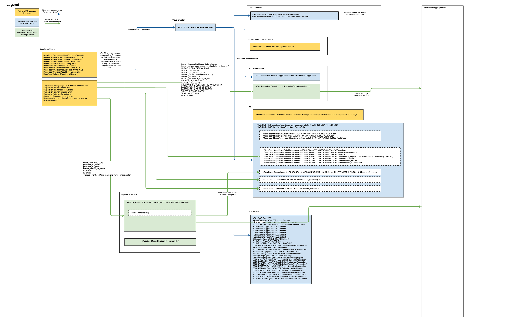
